# Mainboard Hardware 

The Mainboard is the heart of our Autonomous Underwater Vehicle (AUV). This sophisticated board utilizes the power of the STM32H743 microcontroller, a high-performance device that serves as the brain of our AUV. The Mainboard's primary responsibilities are to facilitate real-time communication between various peripheral devices, translate high-level commands into specific device controls, distribute power to peripheral units, and provide robust system monitoring. Its unique role makes it a vital component in maintaining the smooth operation of the AUV, ensuring that each subsystem works in harmony to tackle the challenges of the underwater environment.

<picture>    </picture>

This repository focuses Mainboard's hardware design. For more details on the firmware, visit the [Mainboard Firmware Repository](https://github.com/onur-ulusoy/auv-mainboard-firmware).

<picture>    </picture>

    

<em >AUV Electronics 2022</em>

<picture>    </picture>

    

<picture>    </picture>

    

<picture>    </picture>

## Table of Contents
- [Mainboard Hardware](#mainboard-hardware)
  - [Table of Contents](#table-of-contents)
  - [Board Description](#board-description)
  - [Electronics Design](#electronics-design)
    - [Layer Structure](#layer-structure)
    - [Microcontroller](#microcontroller)
    - [Connectivity](#connectivity)
      - [UART](#uart)
      - [RS232](#rs232)
      - [I2C](#i2c)
    - [Power Circuits](#power-circuits)
      - [Power Inputs and Outputs](#power-inputs-and-outputs)
      - [High-Side Switch (HSS) Circuits](#high-side-switch-hss-circuits)
    - [Other Features](#other-features)
      - [PWM Channels](#pwm-channels)
      - [ADC's](#adcs)
    - [Selections](#selections)
      - [RS Power Chip Selection](#rs-power-chip-selection)
      - [STM 5V Switch](#stm-5v-switch)
      - [UART Switches](#uart-switches)
    - [Debug \& Lighting](#debug--lighting)
  - [Mechanical Design](#mechanical-design)
  - [Manufacturing](#manufacturing)
  - [Technologies Used](#technologies-used)
  - [Project Timeline](#project-timeline)
  - [License](#license)
  - [Gallery](#gallery)

## Board Description

Equipped with the high-performance microcontroller STM32H743, the Mainboard bridges the communication gap between the WARP Driver Board, the on-board computer Jetson Xavier, and other peripheral devices. This enables the Mainboard to effectively translate high-level system commands into specific device controls, ensuring optimal coordination among the various subsystems of the AUV.

Aside from its role as a communication facilitator, the Mainboard also handles the power management of the AUV. It distributes power to peripheral units via dedicated power headers, thereby maintaining a constant, controlled energy supply to each component. This power management function is vital for the reliable operation of each subsystem, ensuring they receive the correct power supply for their operations.

In an effort to strengthen diagnostics and status monitoring, the Mainboard is equipped with multiple LEDs, providing visual indicators of the system status and function. These visual indicators enhance system reliability by providing real-time feedback on the system's operation. Furthermore, they aid in troubleshooting by providing immediate visual cues on any parts of the system that may be experiencing issues.

## Electronics Design

For a comprehensive understanding of the Mainboard's intricate design and layout, you can always visit the [Schematic Sheets](/Schematic%20Sheets/). These detailed documents will provide you with valuable insights into the structure, connections, and functionalities of the board's various components.

<picture>    </picture>

### Layer Structure

Mainboard features a meticulously engineered 4-layer Printed Circuit Board (PCB) structure, designed using the advanced capabilities of Altium Designer. At the heart of the layout are the power and ground layers, smartly employed as inter-layers within the design.

These inter-layers serve more than just conducting electricity or acting as a return path. Their positioning within the inner layers of the board provides a close and uniform ground plane across the board, significantly reducing loop inductance for high-speed signals. This layout strategy inherently offers enhanced signal integrity and reduces the susceptibility of the board to electromagnetic interference (EMI), which could otherwise compromise the reliability and performance of the system.

Moreover, by sandwiching the power and ground planes between the outer signal layers, the PCB achieves a better thermal management. Heat generated by components mounted on the outer layers can be efficiently spread across the plane layers and dissipated, ensuring that the board components always remain within safe operating temperatures. This design is particularly critical in a demanding application environment such as an Autonomous Underwater Vehicle, where managing thermal behavior is crucial to maintain overall system reliability and longevity.

The 4-layer structure, thus, adds significant robustness to the Mainboard, enabling it to effectively support complex and power-intensive operations while ensuring optimal performance and safety.

For a more detailed examination of the board layers and the overall PCB structure, you can visit the file [MAINBOARD.PcbDoc](/MAINBOARD.PcbDoc).

<picture>    </picture>

### Microcontroller
At the heart of the Mainboard is an STM32H743 microcontroller, a powerful, high-performance device that provides the processing muscle needed to handle the complexities of operating an Autonomous Underwater Vehicle.

The firmware for the microcontroller has been developed and customized for the STM32H743, ensuring precise control and superior performance of the hardware. In order to manage tasks efficiently, we've integrated the FreeRTOS - a feature-rich real-time operating system. This system facilitates effective task scheduling and management, thereby ensuring that critical operations such as communication handling, power management, and device control are handled in a timely and efficient manner.

Just as it is with the WARP Driver Board, the priority with the Mainboard's microcontroller is to manage high-importance real-time tasks, such as power distribution and communication processing. FreeRTOS provides the necessary tools to ensure these tasks are dealt with promptly, while also maintaining the performance of lower-priority tasks. This symbiotic relationship between the microcontroller's firmware and the real-time operating system allows the Mainboard to perform its key tasks with optimal precision, efficiency, and reliability.

    

### Connectivity
The Mainboard offers a wide range of connectivity options to interface with the various devices and subsystems that form the architecture of our AUV. This is essential for establishing efficient communication between the different units.

#### UART
The board is equipped with five UART (Universal Asynchronous Receiver/Transmitter) headers directly connected to the microcontroller. These headers primarily serve to establish communication with the sonars in our AUV system. The use of UART facilitates reliable data transfer, a crucial feature in our setup.

#### RS232
The Mainboard features four RS232 headers that are connected to the UARTs of the microcontroller via an RS232 interface IC. This arrangement is especially useful for long-distance communications as it can effectively resist electrical noise that may corrupt data. The RS232 interface is primarily used for communication with the Jetson Xavier, the DVL (Doppler Velocity Log), and the WARP Driver Board.

RS232 and UART Headers of the Mainboard:

    <a>
        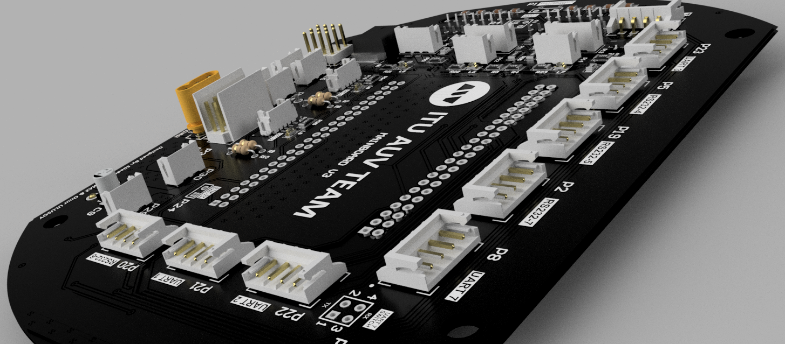
    </a>

#### I2C
In addition, the board includes two I2C (Inter-Integrated Circuit) headers, which are directly connected to the microcontroller. I2C is a highly effective method for short-distance communication and is utilized in this system for exchanging data with pressure and temperature sensors. This bus system enables the microcontroller to access and control these sensors, making real-time monitoring of the AUV's environment possible.The I2C circuits also have their own LEDs to provide real-time monitoring of communication status.

    <a>
        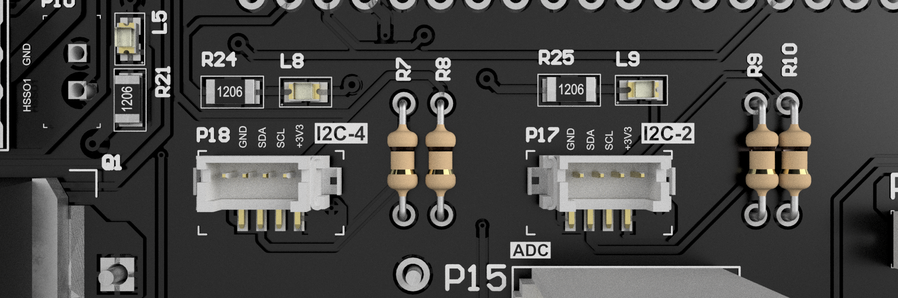
    </a>

### Power Circuits

#### Power Inputs and Outputs

The Mainboard is designed to receive power inputs of 12V and 5V, along with GND (ground). It possesses several power output connectors that can effectively power peripheral units such as the onboard computer, sensors, and its own microcontroller. These connectors ensure reliable and efficient power distribution across the system, supporting the operation of all connected devices.

    <a>
        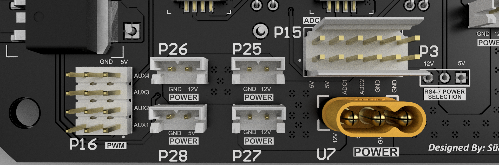
    </a>

#### High-Side Switch (HSS) Circuits

The Mainboard is equipped with three High-Side Switch (HSS) circuits. These circuits are primarily used to control high-power loads, such as the bin dropper solenoid, the torpedo valve, and the Doppler Velocity Log (DVL). The HSS circuits can be powered with either 12V or 5V and are controlled through the GPIO pins of the microcontroller. They also have their own LEDs to provide real-time monitoring of their status. The HSS circuits provide safe and efficient switching operations, ensuring reliable control over these critical components of the AUV.

Selenoid driving with the HSS circuit in simulation can be seen below:

    

3 HSS placement on the PCB:

    <a>
        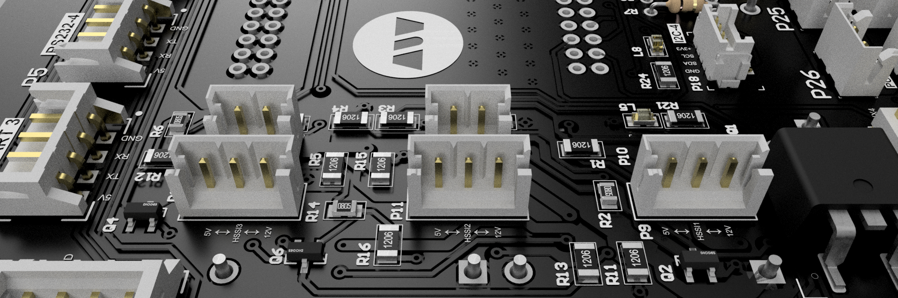
    </a>

### Other Features

#### PWM Channels
The Mainboard provides support for three Pulse Width Modulation (PWM) channels. These channels can be utilized to drive and control peripheral components like the Lumen Light and an External power switch. The ability to manipulate the duty cycle of these signals offers precise control over these devices, allowing for adaptive operation according to varying underwater conditions.

#### ADC's
In addition to its various connectivity options, the Mainboard is equipped with two Analog to Digital Converters (ADCs) integrated within the microcontroller. These ADCs play a crucial role in the Sens APM function, converting the analog measurements into digital data for further processing and evaluation by the microcontroller.

### Selections

In the design of the Mainboard, much thought has been given to providing flexibility and configurability. Various selections have been included in the board's design to manage connections physically and ensure operational continuity.

#### RS Power Chip Selection

The Mainboard includes a selection feature for the RS power chip. This allows for a switch between different power chips as per the requirement, ensuring the most efficient operation for different devices connected via the RS232 interface.

    <a>
        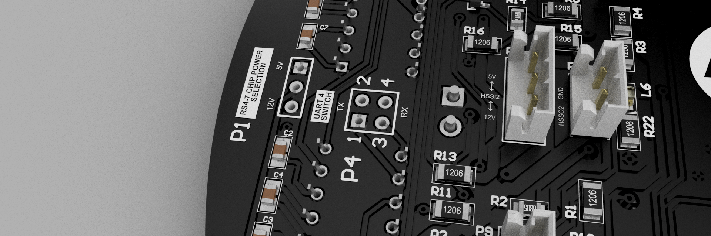
    </a>

#### STM 5V Switch

The Mainboard also has a provision to physically control the power supply to the STM32 microcontroller. With the STM 5V switch, the supply to the microcontroller can be turned on or off without affecting the rest of the board, useful for testing and debugging.

#### UART Switches

Furthermore, the board features UART switches to manage the connections with the devices interfaced through the UART headers. These switches enable direct control over the communication lines, allowing for convenient management of device connections. 

These selection features underscore the Mainboard's adaptability, allowing for a high degree of customization and control over the board's operation. They add an additional layer of robustness, enabling the board to continue operating efficiently even under changing conditions and requirements.

    <a>
        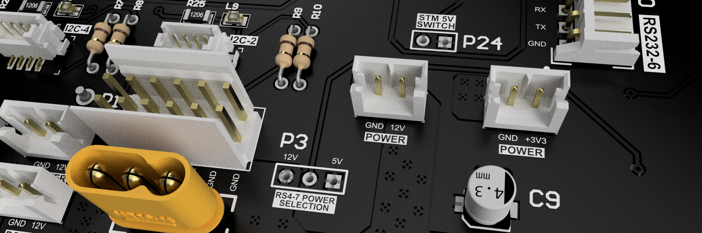
    </a>

### Debug & Lighting

Ensuring effective monitoring and debugging of the Mainboard is crucial to its smooth operation and management. To this end, the Mainboard has been designed with a comprehensive array of LEDs, which serve the dual purpose of debugging support and lighting enhancement.

    <a>
        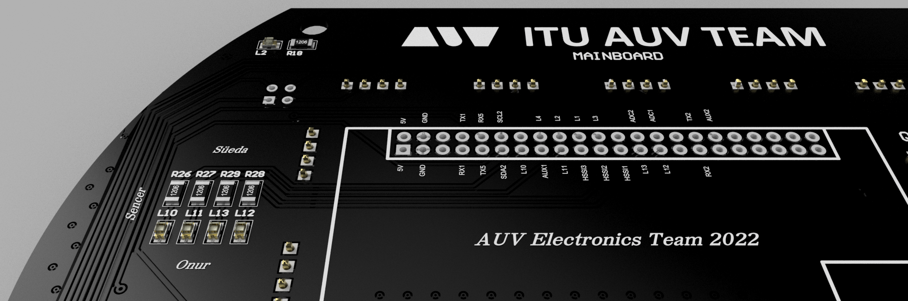
    </a>

## Mechanical Design

The mechanical design of the Mainboard is meticulously crafted to fit within the specific constraints of the Autonomous Underwater Vehicle (AUV). The board is designed to mount into the front tube of the AUV, matching the tube's form factor for an optimized fit.

This is achieved by fastening the board through four corner holes that align with the mounting points within the tube. This approach ensures that the Mainboard remains securely positioned during the AUV's underwater operations, allowing it to endure the potential rigors of the marine environment.

Moreover, this mechanical setup provides convenient accessibility to the board, which aids in the ease of maintenance and part replacements when required. The combination of a compact form factor and a secure mounting design allows the Mainboard to effectively fulfill its crucial roles in power distribution, communication, and control within the AUV.

    <a>
        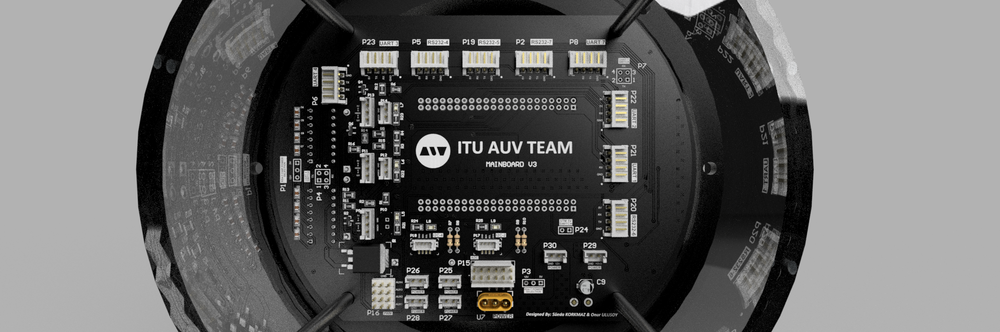
    </a>

<picture>    </picture>

<picture>   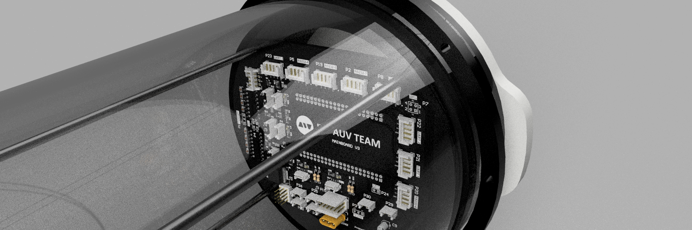 </picture>

## Manufacturing 

In order to ensure that our Mainboard design meets the specific manufacturing specifications of our chosen PCB manufacturer, we have employed the Design Rule Check (DRC) feature in Altium Designer. You can check the detailed report of this rule verification in the output files directory. 

The necessary Gerber files, which include the comprehensive manufacturing details needed to transform our electronic design into a tangible board, are compiled in the [Output](/Output) directory.

We have manufactured and prototyped three versions of the Mainboard with JLC PCB, using the feedback and insights gained from each iteration to continuously refine the design and functionality.

The final products, the manufactured boards, are currently installed on our Autonomous Underwater Vehicle and can be viewed at ITU Bisiklet Evi. This gives interested parties a chance to see our work firsthand and appreciate the tangible representation of our intricate electronics design.

Below you can see a picture from Version 2 of Mainboard:

<picture>   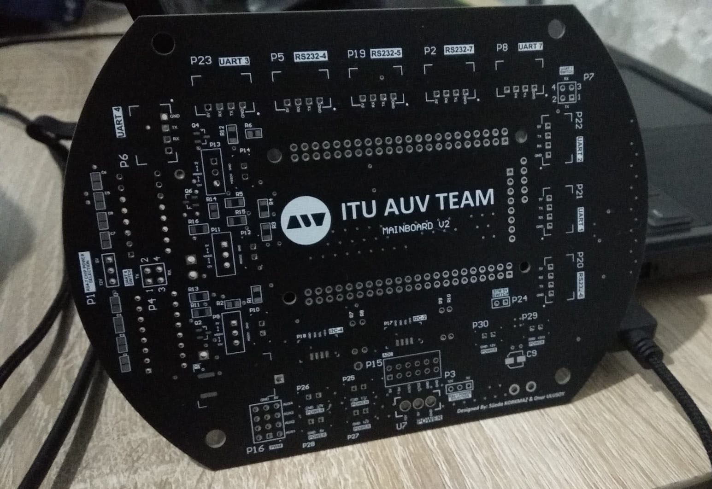 </picture>

## Technologies Used

- **Altium Designer:** We utilized this advanced PCB design software to craft the complex four-layer design of the board. Altium Designer's intuitive interface and comprehensive features allowed us to design and validate the board's electronic components efficiently.

- **STM Technologies:** Our system's microcontroller, the STM32 development board, comes from the STM technology suite. It forms the heart of our design, managing the sophisticated tasks within the AUV.

- **Fusion 360:** For the mechanical design and rendering of the Mainboard, we used Autodesk Fusion 360. This powerful CAD/CAM tool allowed us to visualize and perfect the physical design and ensure its compatibility within the AUV. It also provides us to integrate with mechanics team.

- **Simulation Programs:** To validate and optimize our design, we made extensive use of electronic simulation programs such as Falstad and LTSpice. These tools enabled us to simulate the performance of our electronic circuits under various conditions, allowing us to refine and perfect the design before moving to manufacturing.

## Project Timeline
This project is a proud contribution of the 2022 Electronics Team of the ITU AUV (Istanbul Technical University's Autonomous Underwater Vehicle) Team. Performed in the intervals Dec 2021 - Aug 2022.

Süeda Korkmaz and Onur Ulusoy, members of the team, meticulously carried out the comprehensive design and production of PCBs and circuits using Altium Designer. Three distinct versions were manufactured with the cooperation of JLCPCB. The team also prepared and ordered all electronic components required, and undertook the detailed process of typesetting.

The PCB has found its home at the ITU Bisiklet Evi, in the AUV section of the atelier, where it has been installed on the vehicle.

We extend our gratitude towards our mindset consultant, Sencer Yazıcı, whose guidance has been instrumental throughout the process.

Onur Ulusoy's diligent efforts are to be acknowledged in providing a visually cohesive and detailed representation of our project. His work encompassed the complete set of documentation, including preparing and improving 3D models, producing high-quality renders, and ensuring effective visualization of our design.

    <a>
        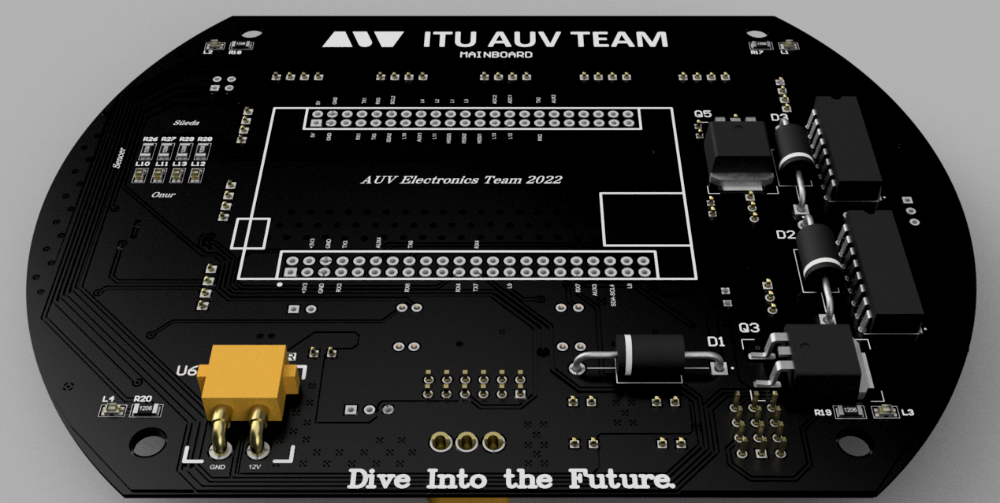
    </a>

## License

This repository contains the design and documentation for the AUV Mainboard, a project PCB by the ITU AUV Team Electonics 2022.

**Licensor:** ITU AUV Team 2022 Electronics

This work is licensed under a [Creative Commons Attribution-NonCommercial-ShareAlike 4.0 International License](http://creativecommons.org/licenses/by-nc-sa/4.0/). You can view the full terms of the license in the [LICENSE](./LICENSE) file in this repository.

**Please note:** When using this project, you must give appropriate credit, including a link to the original GitHub repository: [https://github.com/onur-ulusoy/AUV-Mainboard](https://github.com/onur-ulusoy/AUV-Mainboard)

## Gallery

For a visual tour of the MainBoard, you can explore our [gallery](https://onur-ulusoy.github.io/AUV-Mainboard/Media/gallery.html). Here you'll find detailed images showcasing the design and implementation of the board.
