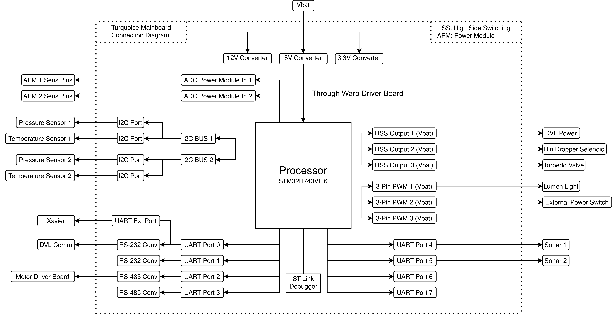

# Mainboard Hardware 

The Mainboard is the heart of our Autonomous Underwater Vehicle (AUV). This sophisticated board utilizes the power of the STM32H743 microcontroller, a high-performance device that serves as the brain of our AUV. The Mainboard's primary responsibilities are to facilitate real-time communication between various peripheral devices, translate high-level commands into specific device controls, distribute power to peripheral units, and provide robust system monitoring. Its unique role makes it a vital component in maintaining the smooth operation of the AUV, ensuring that each subsystem works in harmony to tackle the challenges of the underwater environment.

<picture>    </picture>

This repository focuses Mainboard's hardware design. For more details on the firmware, visit the [Mainboard Firmware Repository](https://github.com/onur-ulusoy/auv-mainboard-firmware).

<picture>    </picture>

    

<em >AUV Electronics 2022</em>

<picture>    </picture>

    

<picture>    </picture>

    

<picture>    </picture>

## Table of Contents
- [Mainboard Hardware](#mainboard-hardware)
  - [Table of Contents](#table-of-contents)
  - [Board Description](#board-description)
  - [Electronics Design](#electronics-design)
    - [Layer Structure](#layer-structure)
    - [Microcontroller](#microcontroller)

## Board Description

Equipped with the high-performance microcontroller STM32H743, the Mainboard bridges the communication gap between the WARP Driver Board, the on-board computer Jetson Xavier, and other peripheral devices. This enables the Mainboard to effectively translate high-level system commands into specific device controls, ensuring optimal coordination among the various subsystems of the AUV.

Aside from its role as a communication facilitator, the Mainboard also handles the power management of the AUV. It distributes power to peripheral units via dedicated power headers, thereby maintaining a constant, controlled energy supply to each component. This power management function is vital for the reliable operation of each subsystem, ensuring they receive the correct power supply for their operations.

In an effort to strengthen diagnostics and status monitoring, the Mainboard is equipped with multiple LEDs, providing visual indicators of the system status and function. These visual indicators enhance system reliability by providing real-time feedback on the system's operation. Furthermore, they aid in troubleshooting by providing immediate visual cues on any parts of the system that may be experiencing issues.

## Electronics Design

For a comprehensive understanding of the Mainboard's intricate design and layout, you can always visit the [Schematic Sheets](/Schematic%20Sheets/). These detailed documents will provide you with valuable insights into the structure, connections, and functionalities of the board's various components.

<picture>    </picture>

### Layer Structure

Mainboard features a meticulously engineered 4-layer Printed Circuit Board (PCB) structure, designed using the advanced capabilities of Altium Designer. At the heart of the layout are the power and ground layers, smartly employed as inter-layers within the design.

These inter-layers serve more than just conducting electricity or acting as a return path. Their positioning within the inner layers of the board provides a close and uniform ground plane across the board, significantly reducing loop inductance for high-speed signals. This layout strategy inherently offers enhanced signal integrity and reduces the susceptibility of the board to electromagnetic interference (EMI), which could otherwise compromise the reliability and performance of the system.

Moreover, by sandwiching the power and ground planes between the outer signal layers, the PCB achieves a better thermal management. Heat generated by components mounted on the outer layers can be efficiently spread across the plane layers and dissipated, ensuring that the board components always remain within safe operating temperatures. This design is particularly critical in a demanding application environment such as an Autonomous Underwater Vehicle, where managing thermal behavior is crucial to maintain overall system reliability and longevity.

The 4-layer structure, thus, adds significant robustness to the Mainboard, enabling it to effectively support complex and power-intensive operations while ensuring optimal performance and safety.

For a more detailed examination of the board layers and the overall PCB structure, you can visit the file [MAINBOARD.PcbDoc](/MAINBOARD.PcbDoc).

<picture>    </picture>

### Microcontroller
At the heart of the Mainboard is an STM32H743 microcontroller, a powerful, high-performance device that provides the processing muscle needed to handle the complexities of operating an Autonomous Underwater Vehicle.

The firmware for the microcontroller has been developed and customized for the STM32H743, ensuring precise control and superior performance of the hardware. In order to manage tasks efficiently, we've integrated the FreeRTOS - a feature-rich real-time operating system. This system facilitates effective task scheduling and management, thereby ensuring that critical operations such as communication handling, power management, and device control are handled in a timely and efficient manner.

Just as it is with the WARP Driver Board, the priority with the Mainboard's microcontroller is to manage high-importance real-time tasks, such as power distribution and communication processing. FreeRTOS provides the necessary tools to ensure these tasks are dealt with promptly, while also maintaining the performance of lower-priority tasks. This symbiotic relationship between the microcontroller's firmware and the real-time operating system allows the Mainboard to perform its key tasks with optimal precision, efficiency, and reliability.

    

