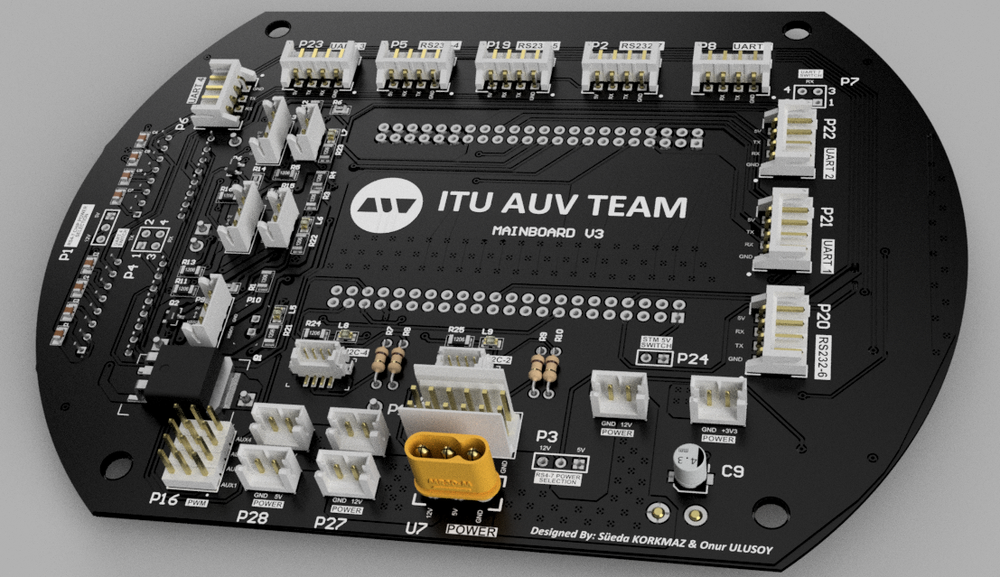
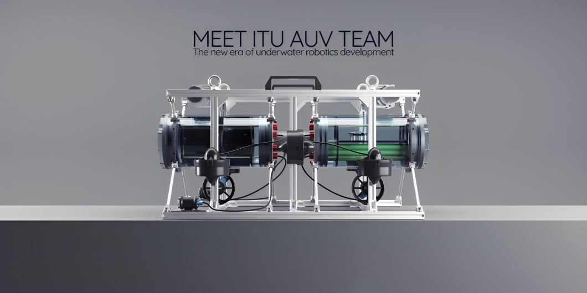
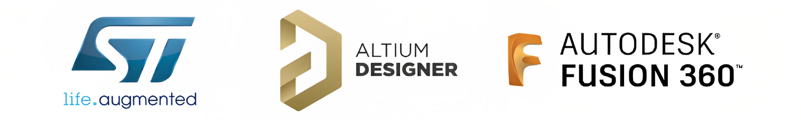

# Mainboard Hardware 

The Mainboard is the heart of our Autonomous Underwater Vehicle (AUV). This sophisticated board utilizes the power of the STM32H743 microcontroller, a high-performance device that serves as the brain of our AUV. The Mainboard's primary responsibilities are to facilitate real-time communication between various peripheral devices, translate high-level commands into specific device controls, distribute power to peripheral units, and provide robust system monitoring. Its unique role makes it a vital component in maintaining the smooth operation of the AUV, ensuring that each subsystem works in harmony to tackle the challenges of the underwater environment.

<picture>    </picture>

This repository focuses Mainboard's hardware design. For more details on the firmware, visit the [Mainboard Firmware Repository](https://github.com/onur-ulusoy/auv-mainboard-firmware).

<picture>    </picture>

    

<em >AUV Electronics 2022</em>

<picture>    </picture>

    

<picture>    </picture>

    

<picture>    </picture>

