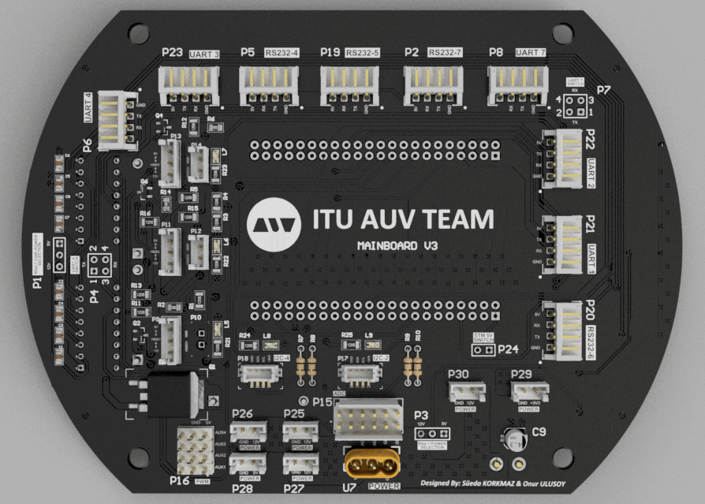

# Mainboard Hardware 

The Mainboard is the heart of our Autonomous Underwater Vehicle (AUV). This sophisticated board utilizes the power of the STM32H743 microcontroller, a high-performance device that serves as the brain of our AUV. The Mainboard's primary responsibilities are to facilitate real-time communication between various peripheral devices, translate high-level commands into specific device controls, distribute power to peripheral units, and provide robust system monitoring. Its unique role makes it a vital component in maintaining the smooth operation of the AUV, ensuring that each subsystem works in harmony to tackle the challenges of the underwater environment.

<picture>    </picture>

This repository focuses Mainboard's hardware design. For more details on the firmware, visit the [Mainboard Firmware Repository](https://github.com/onur-ulusoy/auv-mainboard-firmware).

<picture>    </picture>

    

<em >AUV Electronics 2022</em>

<picture>    </picture>

    

<picture>    </picture>

    

<picture>    </picture>

## Board Description

Equipped with the high-performance microcontroller STM32H743, the Mainboard bridges the communication gap between the WARP Driver Board, the on-board computer Jetson Xavier, and other peripheral devices. This enables the Mainboard to effectively translate high-level system commands into specific device controls, ensuring optimal coordination among the various subsystems of the AUV.

Aside from its role as a communication facilitator, the Mainboard also handles the power management of the AUV. It distributes power to peripheral units via dedicated power headers, thereby maintaining a constant, controlled energy supply to each component. This power management function is vital for the reliable operation of each subsystem, ensuring they receive the correct power supply for their operations.

In an effort to strengthen diagnostics and status monitoring, the Mainboard is equipped with multiple LEDs, providing visual indicators of the system status and function. These visual indicators enhance system reliability by providing real-time feedback on the system's operation. Furthermore, they aid in troubleshooting by providing immediate visual cues on any parts of the system that may be experiencing issues.

## Electronics Design

For a comprehensive understanding of the Mainboard's intricate design and layout, you can always visit the [Schematic Sheets](/Schematic%20Sheets/). These detailed documents will provide you with valuable insights into the structure, connections, and functionalities of the board's various components.

<picture>    </picture>

